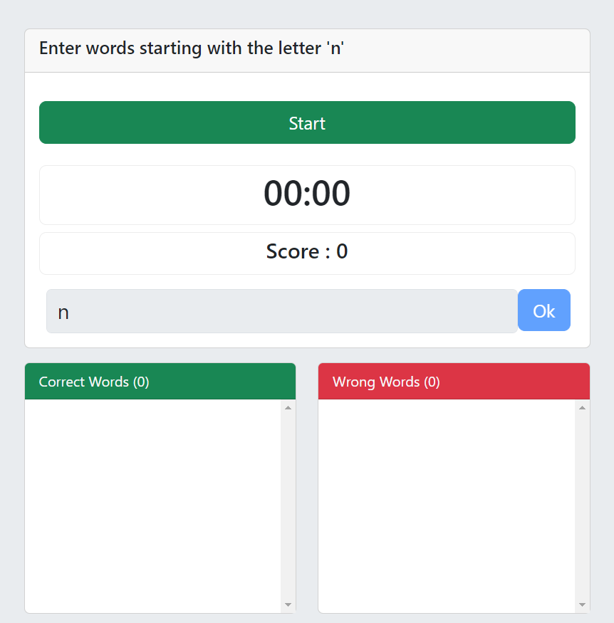

**Word game made with Next.js**

## Getting Started



It is a word game that aims to improve your vocabulary in the English language.
The game is based on typing the words you know starting with a randomly chosen letter with a time limit.

The word list in the repo below is used as the word list.
https://github.com/dwyl/english-words/tree/master

First, run the development server:

```bash
npm run dev
```

Open [http://localhost:3000](http://localhost:3000) with your browser to see the result.